## Full Stack/Application Developer

#### Game development/modding:

I learned C++ by writing **[AsteroidsSDL](https://github.com/DaDevFox/AsteroidsSDL2)** (asteroids but you play as the asteroid) with SDL2. I made an educational **[3D rocket-racing](https://github.com/DaDevFox/SpaceRace)** game and a **[trivia](https://github.com/DaDevFox/TriviaGame)** game. I published **[Elevation](https://github.com/DaDevFox/KCMod_Elevation)**, an extensible **[Reskin Engine](https://github.com/DaDevFox/KC_ReskinEngine)**, and [much more](https://github.com/DaDevFox/KCMods) for **[Kingdoms and Castles](https://store.steampowered.com/app/569480/Kingdoms_and_Castles/)**. 

<!---->

<!--
**DaDevFox/DaDevFox** is a ✨ _special_ ✨ repository because its `README.md` (this file) appears on your GitHub profile.

Here are some ideas to get you started:

- 🔭 I’m currently working on ...
- 🌱 I’m currently learning ...
- 👯 I’m looking to collaborate on ...
- 🤔 I’m looking for help with ...
- 💬 Ask me about ...
- 📫 How to reach me: ...
- 😄 Pronouns: ...
- ⚡ Fun fact: ...
-->
